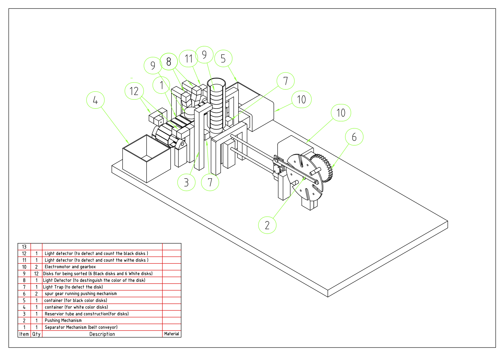
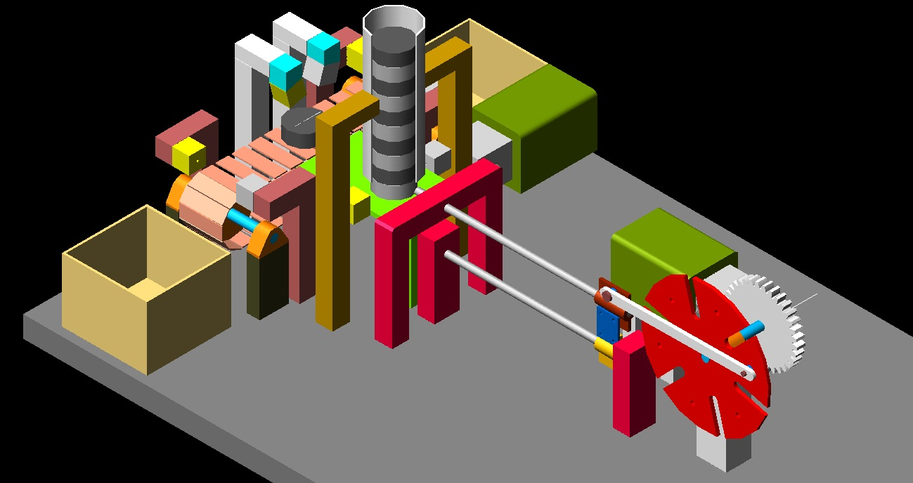

# Disc sorter
Accompanying source code for our machine that sorts discs based on color.

## Design

## Description of the code
In the main there is the setup that runs once the board is loaded with the program, resets variables, initializes the interrupt.
The interrupt runs all the time even when the main loop is not running and the interrupt is responsible for the buttons and the display, so even if the machine is supposed to be running or not.
The interrupt is responsible for setting the running state of the machine.

#### Main.asm
The setup is saving the entry point of the program. There is always a way to set a standard address to the code segment and force the assembler but that would break the reallocation of the assembler but this can bring many problems such as using a reserved address.
We keep the entry point in a variable. We also keep the address of the recovery sections (this runs when recovering from an abort/runs first after recovering from an abort). The outputs are reset, the counters of the disc are reset, the states are reset (running and abort).
If there was an abort and recovery section is run, the abortstate is set to true. The interrupt is initialized inside the setup also but not after recovery from abort. Also if there was an abort, the setup is waiting for the stop button. it is checked through the running state. The buttons are independent from the main loop. They are only handled by the interrupt. There is also a variable called pending stop which is used to avoid the problem that we had when we pressed the stop and start button quickly inside a cycle. This avoids setting the running state again to true before ending the cycle. Finally the mechanisms are reset.

What the main loop does: this runs forever but at the start of every cycle checks if there is a pending stop and then checks if the running variable is still true. After that it runs isDiscAvailable and checks for a disc. If there is a disc, it runs the moveOneDiscToBelt and checks if the disc is white. In this case it runs the dropDiscToTheLeft otherwise dropDiscToTheRight. Then the cycle restarts.

#### ISR.asm
Inside this there is the install_ISR routine which enables the proper register for the timer interrupt to occur. It sets the address of the interrupt handler in the ISR table and sets the timer to 0 so that the interrupt occurs immediately. Every time the interrupt runs, at the end it sets the timer to a value calculated so that the interrupt occurs every 5.5ms. We have a custom timer created in software. It is used to create delays. We only have one timer and it is limited to 55 steps so we needed another way to have more steps for the delay used. There is a global variable customtimer that can be set by the delay routine (discussed later). Every time the interrupt routine runs, if this value is greater than 0 it gets decremented. Every decrement is equal to 5.5ms. Originally we kept a counter of the steps in the interrupt to be able to separate the updatedisplay from the button checking because we had in mind to keep the isr as minimal as possible time wise. It turned out that running both the button checking and the display update works better in the sense that the display is updated better (it flickers less). In this routine, the display is updated and the buttons are checked. First the start stop is checked. If the running state is true it is set to false and the pending stop variable is set to true. If the running state is false it is set to true and pending stop remains as it is. The state of pending state is changed only by the main loop to make sure that when stop is requested the cycle finishes and waits for a new start to be requested. If the abort button is pressed then we use the return function of the interrupt to force the software to go to the recovery address so we extract the first two addresses from the stack, we push the new address we want the program to revert to and push the first address back on the stack.

#### Display.asm
Every time the update display is executed, one digit is updated only. the led display on the processor board can display one digit every time so we need to multiplex and give the human eye the impression that every digit is on. There is an internal digit counter which keeps which digit is to be updated each time and this counter is incremented each time a digit is updated (it goes from 0 to 3). The way that digits are updated is the standard way as shown in the practicum.

#### IO.asm
This includes three routines, isinputon, setoutputon and setoutputoff. Every operation that manipulates ports, uses these routines: to keep track of which outputs are on (processor does not offer support for getting which ports are on) and to save time and effort on testing. It's part of a basic trigger framework and also we standardize the way ports are manipulated and accessed and save registers. Every single one of these routines use as a parameter R1 and everything is returned in R0.

#### Utils.asm
These include utility functions: doabort which triggers an abort(not to be called by an interrupt) used by the rest of the code if required, uses same trick with the stack address swap but it applies to a regular BRS call. We have incwhitediscs which increases the white counter and checks if it is 99 then resets it to 0. We have the same thing for the black discs, the incblackdiscs. We have the delay routine which takes a parameter R1 (the number of 5.5ms steps) to wait. this routine stalls the program until this amount of time passed.

#### Pwm.asm
The pwm function pulses a port but also incorporates some other features that were found common in the occasions where pwm is needed. These features are: timeout that constraints the time that the pwm function runs and also the timeout has an impact on the pwm function. if the timeout occurs we know it from the result. we can optionally pas a port to be checked inside the pwm function. the purpose is to interrupt the execution of the pwm so we can be aware if the port interrupted the execution or the timeout. The another optional parameter is the forcingport which is being checked inside the pwm function: if it set it needs to have one transition inside the time the pwm function runs. if it does not it has an impact on the result of the pwm function. The result of this function is false if routine finished with timeout(there was no checking port or forcing port passed), true which is the case if the function was interrupted by the checking port transition (need to have a port) and either had 0 on the forcingport or the forcingport had one transition in the mean time. Another parameter is the duty cycle (how fast the port is to be pulsed).

#### Machine_interface.asm
We have the function for isdiscwhite which returns true or false depending on the disc color(true if disc is white, false is black). It opens up the reflection lamp, waits for the amount of time that is set in the reflection lamp delay constant, checks the reflection sensor and finally turns off the reflection lamp. Result is stored in R0.
The isdiscavailable function results in either true or false. true if there is another disc on the stack platform. It turns on the stack lamp waits for interrupt lamp delay time, checks the stack sensor, reverses the result of the sensor and returns it as a result and turns off the stack lamp. The routine moveonedisctobelt turns on the stack lamp, and then turns pwm on with the following parameters: the stack sensor as a forcing port, the pusher motor driver as a port to pulse. The pushdiscduty as duty cycle, the push disc timeout as a timeout and the pusher button as a checking port. When pwm routine returns the result is checked and if it is true (it means that a correct motion took place meaning that the checking port had a transition and in the meantime had also a transition) it turns off the lamp and returns. If the result is unknown then it repeats the pwm routine execution with the same parameters. finally if the result was false(that means that the timeout expired thus the mechanism got stuck somewhere, the machine is placed in abort state to prevent damage). We have the dropdisctotheleft that turns on the lamp at the left edge of the conveyor belt. then the pwm routine is executed with the following parameters: no forcing sensor port, the port making the belt go left is used as a pulse port, drop disctimeout as a timeput and the left edge sensor as a checking sensor port. When the pwm routine returns the result is checked and if it is false (meaning that the routine timed out) then the drop routine exits after turning off the belt motor and the lamp. If it is true then the incwhitediscroutine is called because a disc was detected as being dropped in the container and then returns after having turned off the belt motor and left lamp. Exactly the same thing applies to the dropdisctotheright routine but being modified appropriately for the right side. The last routine is the reset mechanisms which initially was supposed to bring all mechanisms to initial positions but it turned out that only the pusher needs to be initialized. It checks the pusher button and if it is pushed then the mechanism is in the back, the right position and so it returns. Otherwise it turns on the stack lamp waits for the interrupt lamp delay time and checks the stack sensor. If the stack sensor is off(there is a disc on the platform) then the mechanism is not moved. Otherwise the pwm is turned on with no forcing port, the pusher motor driver port as pulsing port, the resetpusherduty as duty cycle and the resetpushertimeout constant as timeout and the pusher button as checking port. If result is true then the routine returns after turning off the stack lamp. if the pwm routine returns (times out) then the machine is put in abort state to prevent damage.
 
